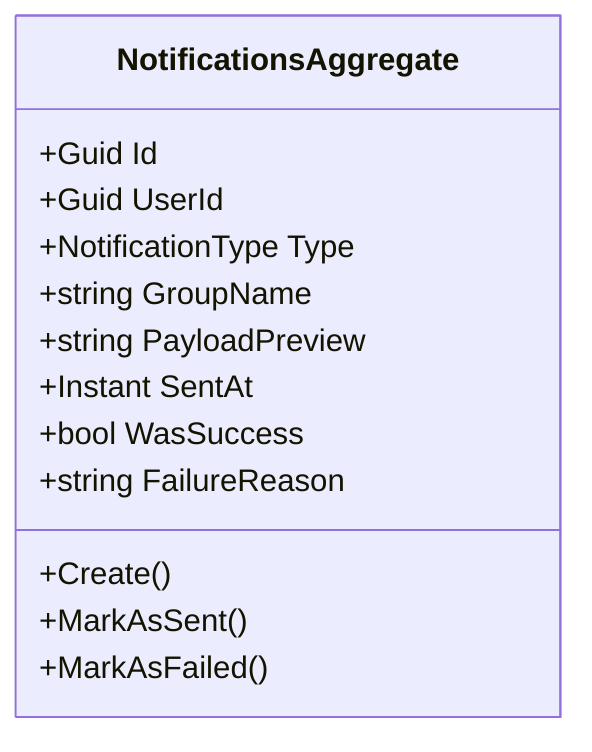
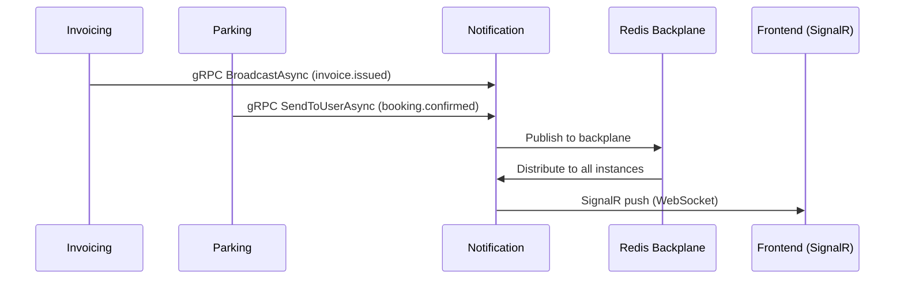

# Notification Microservice

## Overview

The Notification microservice provides real-time notification delivery to connected clients via SignalR WebSocket hubs. Other microservices send notifications through gRPC streaming calls, and this service routes them to the appropriate recipients: individual users, groups, or broadcast to all connected clients of a tenant. It maintains an audit log of all notifications sent, tracks delivery success/failure, and uses a Redis backplane for horizontal scaling across multiple instances.

## Business Context

A modern SaaS platform needs real-time communication to keep users informed of events as they happen: an invoice was issued, a booking was confirmed, a payment was received, a document is overdue. Without a centralized notification service, each microservice would need to manage its own WebSocket connections, leading to duplicated infrastructure, inconsistent delivery guarantees, and inability to scale the real-time layer independently.

The Notification microservice solves this by providing a single hub that all clients connect to and a single gRPC interface that all backend microservices call to push messages. The service handles connection management, group membership, message routing, delivery tracking, and horizontal scaling transparently.

For a new developer: this is the "loudspeaker" of the platform. Backend services whisper into it via gRPC, and it shouts to the right people via WebSocket.

## Ubiquitous Language

| Term             | Definition                                                                                                                        |
| ---------------- | --------------------------------------------------------------------------------------------------------------------------------- |
| Notification     | A message sent to one or more connected clients in real-time. Contains an event name and a JSON payload.                          |
| NotificationType | The delivery scope: User (single recipient), Group (named group), Broadcast (all connected clients of a tenant).                  |
| UserId           | The identifier of the target user for User-type notifications.                                                                     |
| GroupName        | The name of the target group for Group-type notifications (e.g., "unit-305", "admin-panel").                                       |
| PayloadPreview   | A truncated preview of the notification payload stored for audit purposes when the full payload is large.                          |
| SentAt           | The timestamp when the notification was dispatched to the hub.                                                                     |
| WasSuccess       | Whether the notification was successfully delivered to at least one connected client.                                              |
| FailureReason    | The error description if delivery failed (e.g., no connected clients, hub error).                                                  |
| SignalR Hub      | The WebSocket endpoint that clients connect to for receiving real-time notifications.                                              |
| Redis Backplane  | A Redis pub/sub channel that synchronizes notification delivery across multiple service instances for horizontal scaling.           |
| gRPC Streaming   | The interface through which backend microservices push notifications to this service.                                               |
| Event Name       | A dotted identifier for the notification type (e.g., "invoice.issued", "booking.confirmed", "payment.received").                   |
| BroadcastAsync   | The gRPC method that sends a notification to all connected clients of a tenant.                                                    |
| SendToUserAsync  | The gRPC method that sends a notification to a specific connected user.                                                            |
| SendToGroupAsync | The gRPC method that sends a notification to all members of a named group.                                                         |
| Connection       | A WebSocket session between a client and the SignalR hub, identified by a connection ID.                                           |

## Domain Model

The Notification domain has a single aggregate used primarily for audit logging. The `NotificationsAggregate` records each notification attempt with its type, target, outcome, and timing. The actual real-time delivery is handled by the SignalR infrastructure rather than domain logic.

## Data Dictionary

### NotificationsAggregate

Records each notification delivery attempt for audit and debugging.

| Field          | Type             | Description                                              |
| -------------- | ---------------- | -------------------------------------------------------- |
| Id             | Guid             | Unique identifier of the notification record             |
| UserId         | Guid?            | Target user (for User-type notifications)                |
| Type           | NotificationType | Delivery scope: User, Group, or Broadcast                |
| GroupName      | string?          | Target group name (for Group-type notifications)         |
| PayloadPreview | string?          | Truncated payload for audit purposes                     |
| SentAt         | Instant          | Timestamp when the notification was dispatched           |
| WasSuccess     | bool             | Whether delivery succeeded                               |
| FailureReason  | string?          | Error description if delivery failed                     |
| Tenant         | Guid             | Tenant that owns this notification                       |
| CreatedBy      | Guid             | Service or user that initiated the notification          |
| CreatedAt      | Instant          | UTC timestamp of record creation                         |

### Enumerations Reference

**NotificationType:** User, Group, Broadcast

## Integration Architecture

Notification receives messages from all microservices via gRPC and delivers them to connected clients via SignalR. The Redis backplane ensures messages reach clients regardless of which service instance they are connected to.

## API Reference

### SignalR Hub

| Endpoint     | Description                                    |
| ------------ | ---------------------------------------------- |
| `/hub`       | WebSocket connection endpoint for clients      |

### gRPC Services

| Service             | Method           | Description                                       |
| ------------------- | ---------------- | ------------------------------------------------- |
| NotificationService | BroadcastAsync   | Send notification to all connected tenant clients |
| NotificationService | SendToUserAsync  | Send notification to a specific user              |
| NotificationService | SendToGroupAsync | Send notification to a named group                |

### REST (Audit)

| Method | Path                    | Description                              | Auth    |
| ------ | ----------------------- | ---------------------------------------- | ------- |
| GET    | `/api/Notification`     | Paginated list of notification records   | Bearer  |
| GET    | `/api/Notification/{id}`| Get a notification record by ID          | Bearer  |

## Key Design Decisions

- **gRPC for inter-service communication:** Backend microservices use gRPC to push notifications, providing type-safe contracts and efficient binary serialization for high-throughput scenarios.

- **Redis backplane for scaling:** SignalR's Redis backplane ensures that notifications reach all connected clients regardless of which service instance handled the gRPC call, enabling horizontal scaling.

- **Audit logging as domain aggregate:** Every notification attempt is persisted as a `NotificationsAggregate` record, enabling debugging of delivery issues and audit compliance.

- **Event-name convention:** Notifications use dotted event names (e.g., "invoice.issued", "booking.confirmed") to allow clients to subscribe to specific categories.

- **Fire-and-forget delivery:** Notifications are best-effort. If no client is connected, the notification is recorded as sent but may not be received. Persistent notification history is the responsibility of each client application.

- **Tenant-scoped delivery:** Broadcast notifications only reach clients connected under the same tenant, ensuring tenant isolation at the real-time layer.

## Related Microservices

| Microservice | Direction     | Integration Point                                                    |
| ------------ | ------------- | -------------------------------------------------------------------- |
| Invoicing    | Inbound (gRPC)| Sends invoice.issued, invoice.paid, invoice.overdue notifications    |
| Parking      | Inbound (gRPC)| Sends booking.confirmed, reservation notifications                   |
| All Services | Inbound (gRPC)| Any microservice can send notifications via the gRPC interface       |
